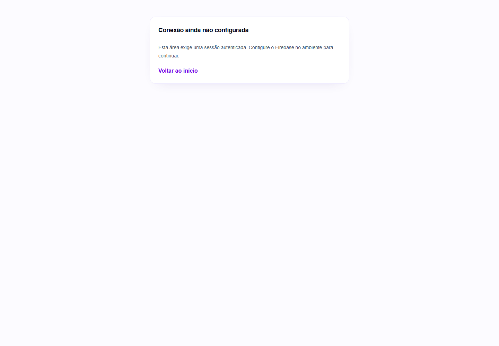

# Cosmaker OS

Plataforma de gestão para cosmakers e ateliês de cosplay. O repositório preserva a arquitetura inicial e está sendo implementado em módulos, conforme as especificações do produto e do modelo multi-tenant.

> O primeiro corte funcional cobre a base Next.js, telas públicas iniciais, autenticação Firebase e envio de solicitação de orçamento. Os outros módulos ainda estão em implementação; consulte o [status detalhado](docs/STATUS.md).

## Executar localmente

Requisitos: Node.js compatível com Next.js 15 e npm.

```bash
npm install
cp .env.example .env.local
npm run dev
```

Sem as variáveis do Firebase, o site público e as telas de autenticação abrem, mas cadastro, login e envio da solicitação ficam indisponíveis. Preencha `.env.local` com as configurações do Firebase Web e o `NEXT_PUBLIC_DEFAULT_ATELIER_ID` para conectar Authentication, Firestore e Storage. Nunca coloque credenciais administrativas ou segredos de serviços em variáveis `NEXT_PUBLIC_*`.

## Verificações

```bash
npm test
npm run lint
npx tsc --noEmit
npm run functions:build
npm run build
```

Para atualizar as imagens no README, execute o app local e rode `npm run screenshots`. O script Playwright salva capturas em `docs/screenshots/` e falha em erro de navegação ou exceção de página.

## Telas desenvolvidas

As imagens abaixo são capturas do build de produção e mostram todas as rotas implementadas nesta entrega. As rotas de outros módulos ainda estruturais não são apresentadas como telas concluídas.

<details open>
<summary>Site público — página inicial</summary>


Versão móvel:


</details>

<details open>
<summary>Solicitação de orçamento</summary>


Versão móvel:


</details>

<details>
<summary>Autenticação — entrar</summary>


Versão móvel:


</details>

<details>
<summary>Autenticação — criar conta</summary>


</details>

<details>
<summary>Autenticação — recuperar senha</summary>


</details>

<details>
<summary>Autenticação — verificar e-mail</summary>


</details>

<details>
<summary>Solicitação — confirmação e estado vazio</summary>


</details>

<details>
<summary>Área do cliente — acesso protegido e configuração necessária</summary>


</details>

<details>
<summary>Área do ateliê — acesso protegido e configuração necessária</summary>


</details>

<details>
<summary>Administração — acesso protegido e configuração necessária</summary>


</details>

## Arquitetura e documentação

- [Status do produto e auditoria](docs/STATUS.md)
- [Especificação funcional](docs/initial/estruturas/sistema.txt)
- [Modelo Firebase e multi-tenancy](docs/initial/estruturas/firebase.txt)
- [Documentação inicial](docs/initial/README.md)

Organização da aplicação: `app/`, `components/`, `features/`, `services/`, `repositories/`, `hooks/`, `providers/`, `lib/`, `types/`, `schemas/` e `functions/`.
