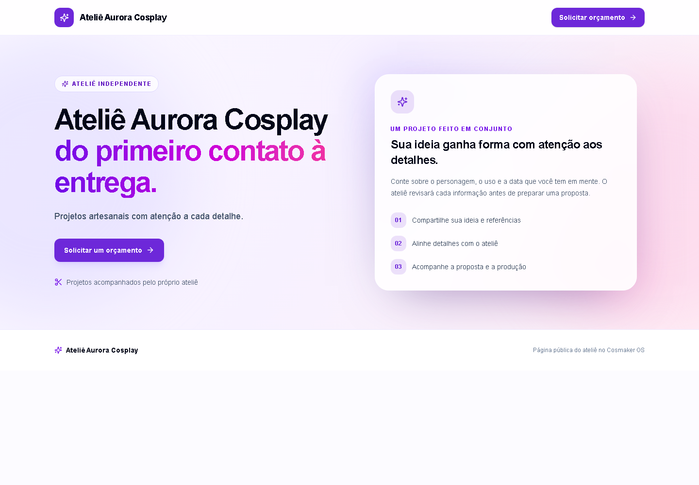
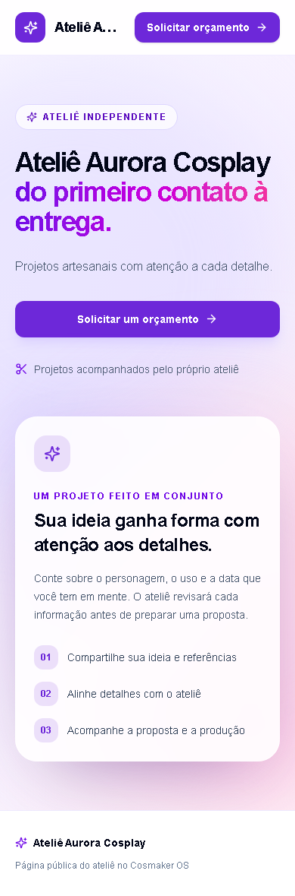
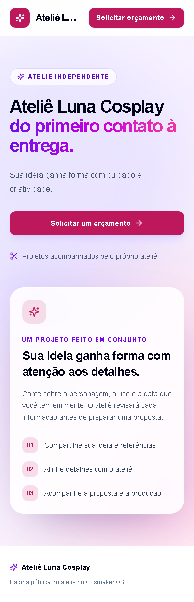

# Screenshots reais

As imagens abaixo são capturas do app executando contra o Firebase Emulator após o build. Aurora e Luna são tenants fictícios de teste. Estas capturas mostram estado real renderizado pelo código, não mockups.

| Tela | Tenant | Formato | Evidência |
| --- | --- | --- | --- |
| Landing | A — Aurora | Desktop |  |
| Landing | A — Aurora | Mobile |  |
| Solicitação de orçamento | A — Aurora | Desktop |  |
| Solicitação de orçamento | A — Aurora | Mobile |  |
| Landing | B — Luna | Desktop |  |
| Landing | B — Luna | Mobile |  |
| Solicitação de orçamento | B — Luna | Desktop |  |
| Solicitação de orçamento | B — Luna | Mobile |  |

Reprodução: inicialize Emulator e app local, aplique `npm run seed:emulator`, depois execute `npm run screenshots:tenants`. O script captura somente as rotas públicas A/B em desktop e mobile. Capturas anteriores de dashboard, produção e plataforma estão preservadas em `docs/screenshots/` e pertencem a marcos anteriores.
