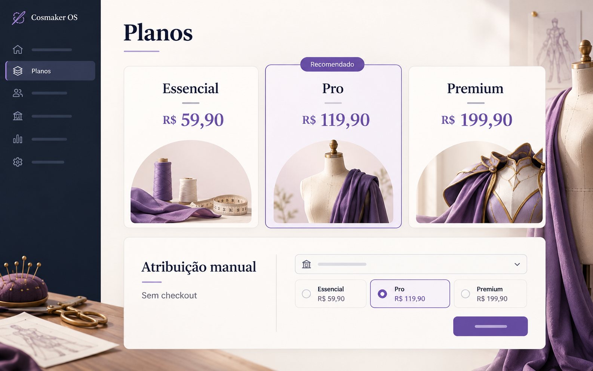
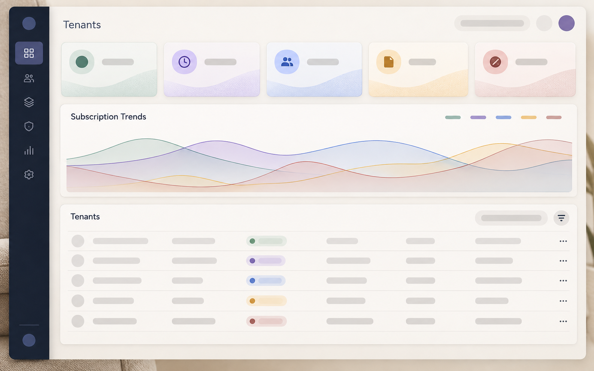

# Visuais gerados e conceituais v0.2.0

Estas imagens são **CONCEITUAIS / IDEALIZADAS**, produzidas pelo ImageGen integrado do Codex ou preservadas do marco anterior. Nenhuma é screenshot real, prova de runtime, promessa de feature ou representação do estado comercial de um cliente. A evidência real está no documento SCREENS e nos testes.

| Arquivo | Tipo / objetivo | Origem e identificação | Estado | Lead |
| --- | --- | --- | --- | --- |
| `generated/concepts/commercial-plans-admin-concept.png` | Conceito visual da administração de planos | ImageGen integrado; original `exec-d072dfda-ca36-4d5b-bded-1aee4a81b50d.png` | **CONCEITUAL** | Nenhum |
| `generated/mockups/commercial-dashboard-idealized.png` | Dashboard comercial idealizado para direção visual | ImageGen integrado; original `exec-53d08a15-ecf2-4e86-8f58-3a3768805e12.png` | **IDEALIZADO** | Nenhum |
| `generated/covers/atelier-editorial-concept-cover.png` | Capa editorial do universo de criação artesanal/cosplay | ImageGen integrado; original `exec-ca433467-932c-4ad7-8123-275f9f039f28.png` | **CONCEITUAL** | Nenhum |
| `generated/covers/cosmaker-os-concept-cover.png` | Capa editorial de apresentação preservada do core | Cópia byte a byte do asset da v0.1.0, originalmente ImageGen | **CONCEITUAL / IDEALIZADA** | Nenhum |

## Registro de origem e prompt

Os três originais novos permanecem em `C:/Users/MICRO-10/.codex/generated_images/01a118a5-d29a-7c80-a088-f6f2cf7f9d40/`, sem screenshot fornecida como base. A geração foi executada e as imagens foram visualmente inspecionadas pelo agente principal antes da cópia para esta versão.

Os resumos abaixo registram intenção visual; são resumos, não transcrição literal dos prompts enviados ao serviço:

- **Administração de planos:** direção conceitual de interface Cosmaker para administração dos planos Essencial/Pro/Premium, com identificação de material conceitual, preços aprovados e gestão manual. Não autoriza uma matriz de features/cotas.
- **Dashboard comercial:** visão idealizada de acompanhamento comercial e estados de tenant para orientar apresentação visual. Qualquer composição, gráfico ou métrica imaginada pertence ao conceito e não representa tela entregue ou dado real.
- **Capa editorial:** peça visual do universo de ateliê/cosplay e criação artesanal para apresentação Cosmaker, sem dados de clientes/leads e sem afirmar runtime.

O material histórico permanece em [GENERATED_VISUALS v0.1.0](../v0.1.0/GENERATED_VISUALS.md). `generated/lead-adapted/` continua sem peça personalizada, pois nenhum lead confirmado foi inventado. Os assets gerados não são utilizados no app como evidência ou configuração comercial.
