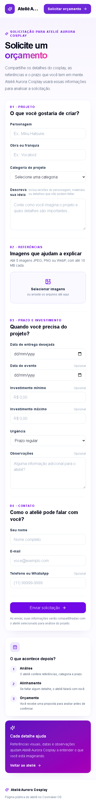
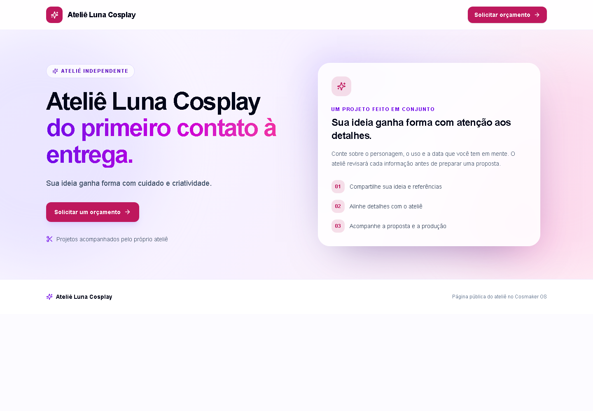
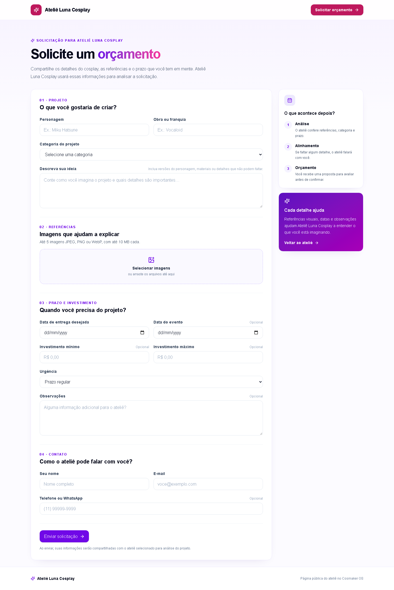
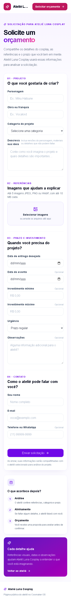

# Screenshots reais v0.2.0

As capturas históricas mostram o app real contra Firebase Emulator com Aurora e Luna fictícias. As seis novas capturas abaixo foram geradas pelo app real contra o Emulator em 09/10/2026 e inspecionadas visualmente. São evidência da interface e do estado sintético mostrado; autorização e enforcement são comprovados pelas suítes E2E, Functions e Rules, não apenas por imagens.

## Capturas comerciais esperadas

| Tela / estado | Rota / fixture | Formato | Arquivo | Estado |
| --- | --- | --- | --- | --- |
| Catálogo/preços e gestão manual | `/admin/planos`, Platform Owner | Desktop 1440 × 1000 | [commercial-plans-desktop.png](screenshots/commercial-plans-desktop.png) | PASS · inspecionada |
| Catálogo/preços responsivo | `/admin/planos`, Platform Owner | Mobile 390 × 844 | [commercial-plans-mobile.png](screenshots/commercial-plans-mobile.png) | PASS · inspecionada |
| Edição de estado comercial e auditoria | `/admin/ateliers/atelier-premium` | Desktop 1440 × 1000 | [commercial-state-assignment.png](screenshots/commercial-state-assignment.png) | PASS · inspecionada |
| Aviso de trial Premium com fim explícito | `/atelier`, Trial | Desktop 1440 × 1000 | [commercial-trial-banner.png](screenshots/commercial-trial-banner.png) | PASS · inspecionada |
| Aviso demo Premium e probe local | `/atelier`, Demo | Desktop 1440 × 1000 | [commercial-demo-banner-and-probe.png](screenshots/commercial-demo-banner-and-probe.png) | PASS · inspecionada |
| Acesso negado pela política sintética de status | `/atelier`, past_due | Mobile 390 × 844 | [commercial-policy-denied.png](screenshots/commercial-policy-denied.png) | PASS · inspecionada |

O script verifica o marcador de modo Emulator antes de autenticar, espera o conteúdo da tela e captura página completa. Use app/emuladores locais sem dados reais e seeds sintéticos. A edição visual do estado não substitui os testes de autorização/auditoria do servidor. Uma captura de probe `TEST_ONLY` não anuncia diferença de plano nem cota comercial.

## Oito capturas reais preservadas do core v0.1.0

As cópias abaixo preservam os arquivos do marco anterior; cada origem é referenciada para rastreabilidade.

| Tela | Tenant | Formato | Cópia nesta versão | Origem preservada |
| --- | --- | --- | --- | --- |
| Landing | A — Aurora | Desktop |  | [v0.1.0](../v0.1.0/screenshots/tenant-a-landing-desktop.png) |
| Landing | A — Aurora | Mobile |  | [v0.1.0](../v0.1.0/screenshots/tenant-a-landing-mobile.png) |
| Solicitação de orçamento | A — Aurora | Desktop |  | [v0.1.0](../v0.1.0/screenshots/tenant-a-quote-request-desktop.png) |
| Solicitação de orçamento | A — Aurora | Mobile |  | [v0.1.0](../v0.1.0/screenshots/tenant-a-quote-request-mobile.png) |
| Landing | B — Luna | Desktop |  | [v0.1.0](../v0.1.0/screenshots/tenant-b-landing-desktop.png) |
| Landing | B — Luna | Mobile |  | [v0.1.0](../v0.1.0/screenshots/tenant-b-landing-mobile.png) |
| Solicitação de orçamento | B — Luna | Desktop |  | [v0.1.0](../v0.1.0/screenshots/tenant-b-quote-request-desktop.png) |
| Solicitação de orçamento | B — Luna | Mobile |  | [v0.1.0](../v0.1.0/screenshots/tenant-b-quote-request-mobile.png) |

Reprodução histórica: `npm run screenshots:tenants` com Emulator/app e seed local. As capturas anteriores de plataforma, cliente e produção em `docs/screenshots/` continuam preservadas como referência de marcos anteriores.
